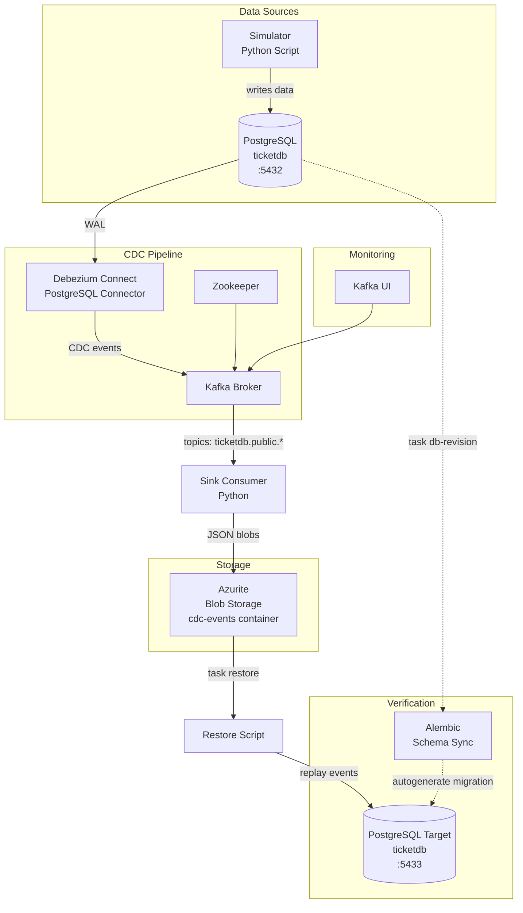
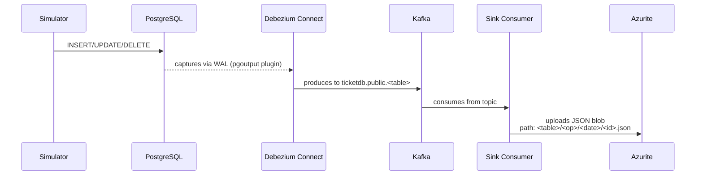
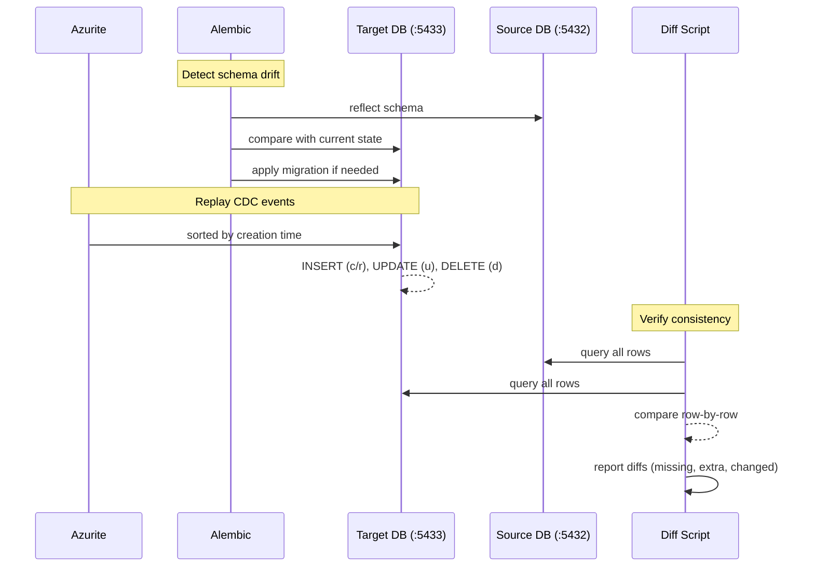
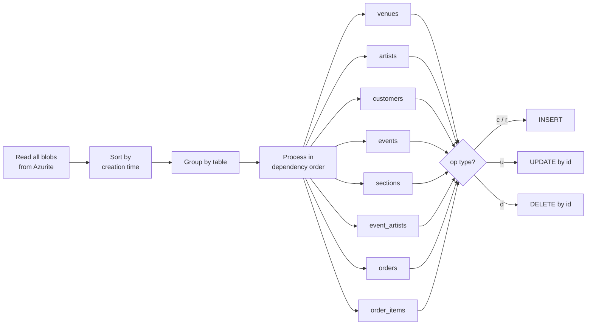
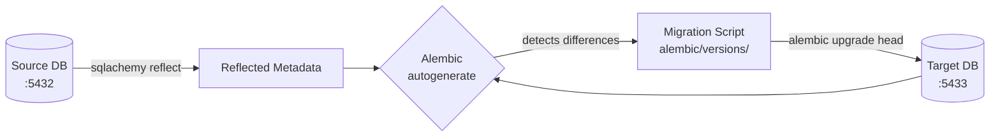
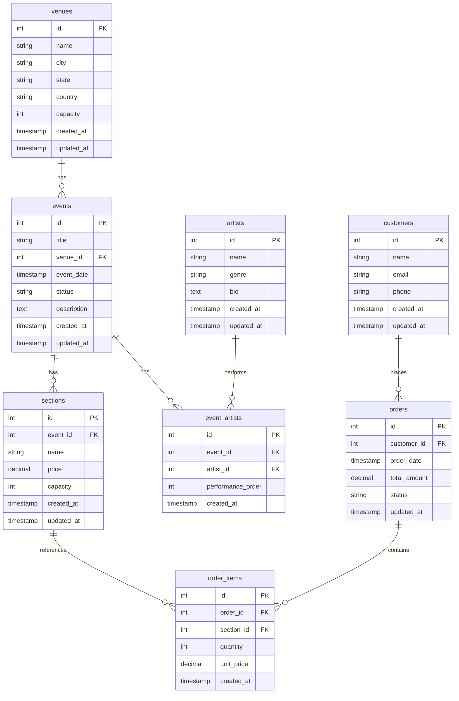

# Architecture

## System Overview

## Data Flow

## Restore & Verification Flow

## Restore Logic

The restore script (`src/restore.py`) processes CDC blobs in FK-safe order:

## Alembic Schema Sync

Alembic compares the current schema of the source database (reflected into `target_metadata`) against the target database's actual schema. Any drift — new tables, columns, constraints, or type changes — is captured in an auto-generated migration script.

## Database Schema

## Services

| Service        | Image                                      | Port(s)           | Purpose                                 |
|----------------|--------------------------------------------|-------------------|-----------------------------------------|
| Zookeeper      | confluentinc/cp-zookeeper                  | 2181              | Kafka coordination                      |
| Kafka          | confluentinc/cp-kafka                      | 9092, 29092       | Message broker for CDC events           |
| PostgreSQL     | debezium/postgres                          | 5432              | Source database with WAL-level CDC      |
| PostgreSQL     | postgres                                   | 5433              | Target database for verification        |
| Debezium       | debezium/connect                           | 8083              | CDC connector runtime                   |
| Azurite        | mcr.microsoft.com/azure-storage/azurite    | 10000-10002       | Local Azure Blob Storage emulator       |
| Kafka UI       | provectuslabs/kafka-ui                     | 8080              | Kafka topic browser                     |
| Sink           | custom (Python)                            | —                 | Consumes CDC events, writes to Azurite  |
| Simulator      | custom (Python)                            | —                 | Generates random ticket data            |
